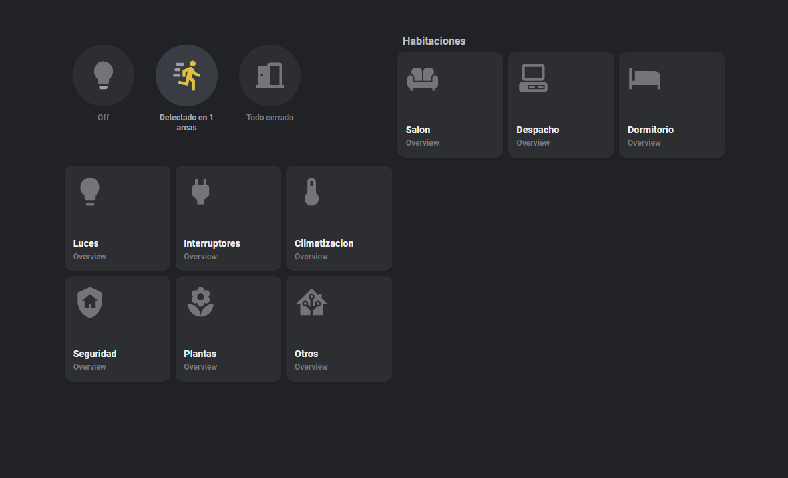
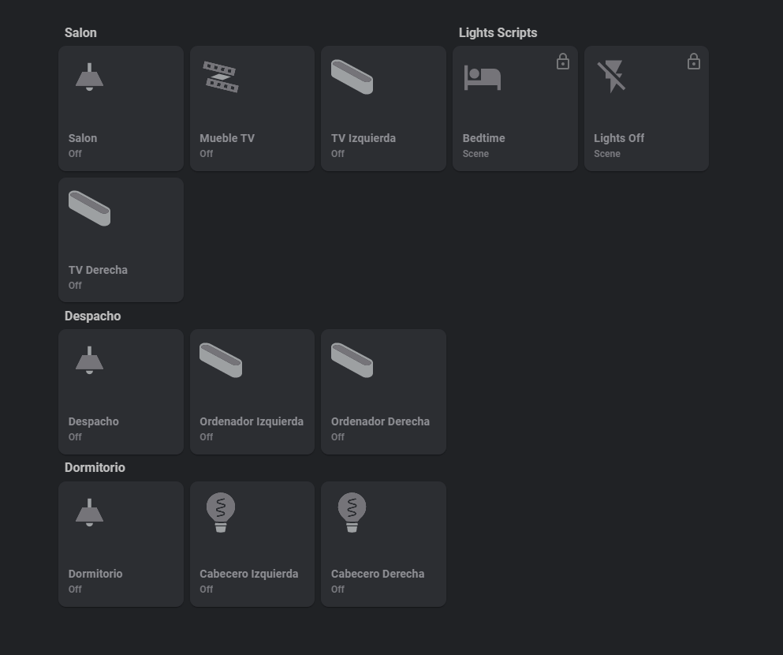
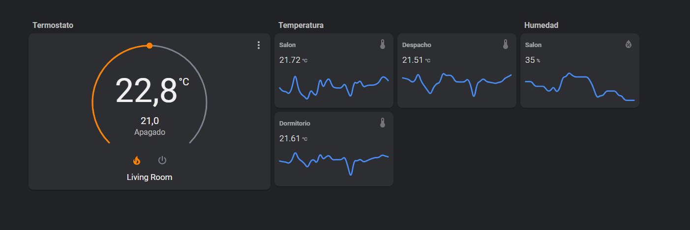

## Install
* Copy the `lovelace` folder within the `config` folder in HA
* Copy the `ui-lovelace.yaml` file within the `config` folder as well

## HA Cards:
Here you have a list of all the cards that I'm using in this theme:

- button-card
- mini-graph-card
- gap-card.js
- decluttering-card
- card-mod.js
- layout-card.js
- mini-media-player

## Screenshots:

